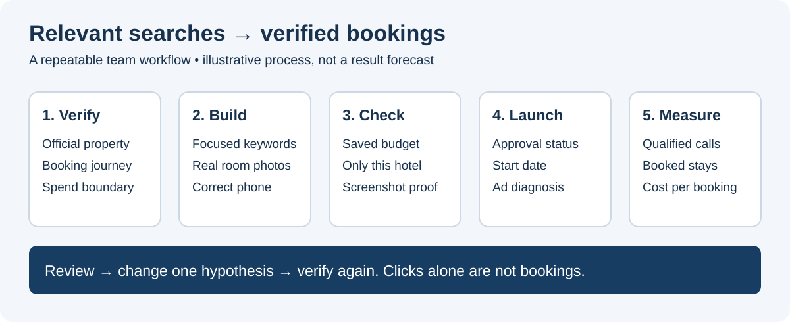
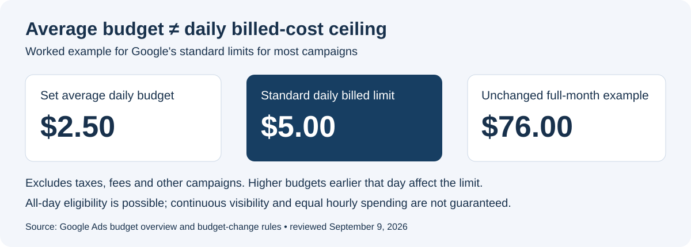

# Hotel Google Ads Playbook

A practical team guide to turn relevant hotel searches into reservation calls and direct bookings—while controlling spend and recording what actually happened.

**Start here:** [Complete operating playbook](docs/PLAYBOOK.md) · [New hotel template](templates/HOTEL-BRIEF.md) · [Launch checklist](templates/LAUNCH-CHECKLIST.md) · [Weekly review](templates/WEEKLY-REVIEW.md)

## Use this in one working session

1. Copy the hotel brief and verify the official booking page, phone, amenities and photo rights.
2. Agree on the spend boundary and measurement plan before building the campaign.
3. Follow the playbook, capturing each meaningful setup step in a **private** evidence folder.
4. Complete the launch checklist and reopen saved settings to verify them.
5. Review real queries, qualified calls and confirmed bookings; record the next decision in the weekly review.

No software installation or Google Ads API access is required to read or use these documents. This repository does not create campaigns, change budgets or automatically monitor accounts.

## Preserve campaign history

Use the [account and campaign continuity guide](docs/ACCOUNT-CONTINUITY.md) for stable IDs, multiple ads under one budget, per-hotel reporting and future manager-account/API access. Optimize existing campaigns in place; document any necessary one-time type replacement.

## Next campaign review

Read the [September 11 improvement priorities](docs/NEXT-REVIEW-2026-09-11.md): reconcile historical billing, verify reservation measurement, inspect actual search terms and preserve stable campaigns. These are recommendations, not completed live changes.

## Latest research

Read the [September 2026 research update](docs/RESEARCH-UPDATE-2026-09.md) before launch: measurement traps, conditional brand defense, CPC adjustments, genuine image variety and free booking-link reporting. It records reusable recommendations, not live account changes.

## Recommended starting approach

For a small, tightly constrained hotel budget, start with one focused Search campaign, property/city exact and phrase keywords, genuine room/exterior photos and a hotel-specific phone/location asset. This is a starting hypothesis, not a universal recipe. Use evidence to decide whether to expand.

**Bookings are the goal.** Impressions, clicks and calls describe parts of the journey; they do not prove a completed reservation. First position, continuous all-day delivery and a particular return cannot be promised.

## Understand the budget before launch

A `$5` average daily setting is **not** a `$5` daily billed-cost ceiling. The worked example in the [budget section](docs/PLAYBOOK.md#2-define-the-spend-boundary) uses `$2.50` average for Google's standard `$5` daily billed-ad-cost limit for most campaigns. Confirm campaign eligibility, taxes, fees, other campaigns and same-day budget changes before using this approach.

## What the team can edit

| File | Purpose |
| --- | --- |
| [PLAYBOOK.md](docs/PLAYBOOK.md) | Research, campaign setup, photos, measurement, launch and optimization |
| [HOTEL-BRIEF.md](templates/HOTEL-BRIEF.md) | Blank reusable intake and campaign plan |
| [LAUNCH-CHECKLIST.md](templates/LAUNCH-CHECKLIST.md) | Saved-state verification and screenshot manifest |
| [WEEKLY-REVIEW.md](templates/WEEKLY-REVIEW.md) | Results, limitations, decisions and next owner |
| [LESSONS.md](docs/LESSONS.md) | Reusable lessons from the Gallatin hotel setup work |
| [assets/README.md](assets/README.md) | Image instructions and a place to add approved visuals |
| [CONTRIBUTING.md](CONTRIBUTING.md) | How to propose updates through GitHub |

## Public sharing and private evidence

Anyone can read this repository without signing in. Editing requires GitHub access: contributors can fork it and open a pull request, or an owner can grant collaborator access separately. Public visibility does not grant write access.

Use fictional or explicitly approved public examples here. Keep account/customer IDs, billing screens, credentials, guest information, private document links and unapproved client results outside Git history. The original account screenshots and private Google Docs are intentionally not included. Original diagrams below explain the process; they are not Google UI screenshots or performance evidence.

## Document style

Use clear headings, concise sentences, dated sources and captions. Use **Calibri** in Google Docs, Word and exported reports. GitHub controls Markdown's reading font; SVG diagrams request Calibri with a sans-serif fallback.

## Maintenance

Initial edition: September 9, 2026. This is a reusable process, **not a live campaign-status dashboard**. Recheck Google's linked documentation before each launch because controls and policies can change. [Source register](docs/PLAYBOOK.md#sources).
